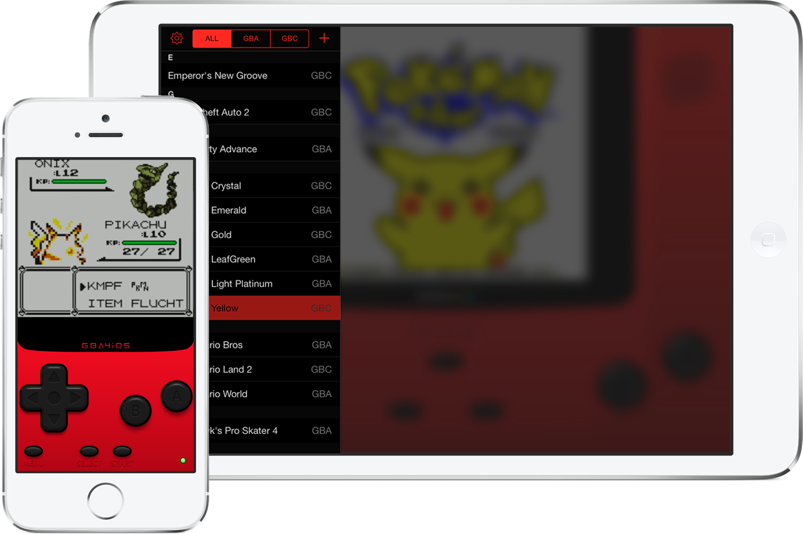

# GBA4iOS 2.2

The number one Game Boy Advance emulator for iOS.  
Rewritten from the ground up for iOS 7 and working with the latest iOS 14.

### New Features

- Completely new emulator core based on VBA-M
- iPad Support
- Full GBC game compatibility
- Cheat Codes
- Dropbox Sync
- Customizable Skins
- Sustain Button
- Event Distribution
- Wario Ware: Twisted Support
- iOS 7 Controller support
- URL Scheme support (gba4ios://ROM%20Name%20Here)
- Fully migrated to WKWebView
- Compatible with iOS 14
- Dark Mode

### Classic Features

- Save States
- Portrait + Landscape layouts
- Frameskip
- iTunes File Sharing Support
- Fast Forward

## Getting Started

GBA4iOS can be opened in Xcode and deployed to an iOS device just like an other app, but there are a few steps that need to be completed first:

- Download and install [Cocoapods](http://cocoapods.org/)
- From the root directory, run the following command in terminal:
`pod install`
- Open up the .xcworkspace file, and deploy to your device!

## Requirements

- GBA4iOS 2.0 requires Xcode 5 or later, targeting iOS 7.0 and above.
- For deployment to iOS 6 devices, use the project in the 1.x branch.

## Contact

GBA4iOS was created by developer [Riley Testut](http://twitter.com/rileytestut) and graphic designer [Paul Thorsen](http://twitter.com/pau1thor).

Questions about GBA4iOS? Check [gba4iosapp.com/faq/](http://www.gba4iosapp.com/faq/) or email support@gba4iosapp.com.
